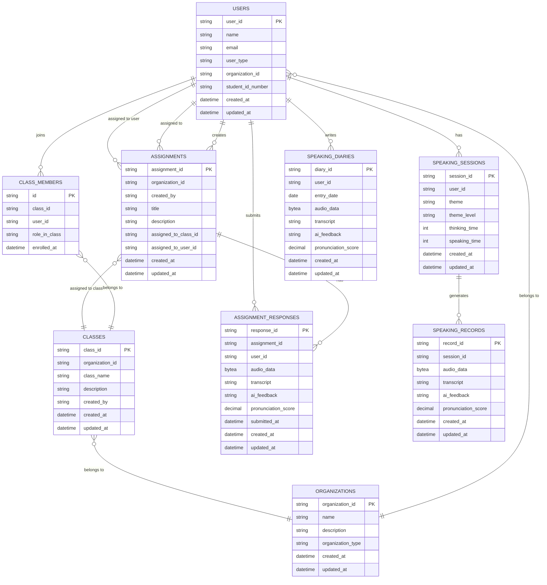

```mermaid
erDiagram
    USERS {
        string user_id PK
        string name
        string email
        string user_type
        string organization_id
        string student_id_number
        datetime created_at
        datetime updated_at
    }

    ORGANIZATIONS {
        string organization_id PK
        string name
        string description
        string organization_type
        datetime created_at
        datetime updated_at
    }

    CLASSES {
        string class_id PK
        string organization_id
        string class_name
        string description
        string created_by
        datetime created_at
        datetime updated_at
    }

    CLASS_MEMBERS {
        string id PK
        string class_id
        string user_id
        string role_in_class
        datetime enrolled_at
    }

    ASSIGNMENTS {
        string assignment_id PK
        string organization_id
        string created_by
        string title
        string description
        string assigned_to_class_id
        string assigned_to_user_id
        datetime created_at
        datetime updated_at
    }

    ASSIGNMENT_RESPONSES {
        string response_id PK
        string assignment_id
        string user_id
        bytea audio_data
        string transcript
        string ai_feedback
        decimal pronunciation_score
        datetime submitted_at
        datetime created_at
        datetime updated_at
    }

    SPEAKING_SESSIONS {
        string session_id PK
        string user_id
        string theme
        string theme_level
        int thinking_time
        int speaking_time
        datetime created_at
        datetime updated_at
    }

    SPEAKING_RECORDS {
        string record_id PK
        string session_id
        bytea audio_data
        string transcript
        string ai_feedback
        decimal pronunciation_score
        datetime created_at
        datetime updated_at
    }

    SPEAKING_DIARIES {
        string diary_id PK
        string user_id
        date entry_date
        bytea audio_data
        string transcript
        string ai_feedback
        decimal pronunciation_score
        datetime created_at
        datetime updated_at
    }

    %% リレーションシップの定義
    USERS          ||--o{ CLASS_MEMBERS : "joins"
    CLASS_MEMBERS  }o--|| CLASSES : "belongs to"
    USERS          }o--|| ORGANIZATIONS : "belongs to"
    CLASSES        }o--|| ORGANIZATIONS : "belongs to"

    USERS          ||--o{ ASSIGNMENTS : "creates"
    ASSIGNMENTS    }o--|| USERS : "assigned to" 

    ASSIGNMENTS    ||--o{ ASSIGNMENT_RESPONSES : "has"
    USERS          ||--o{ ASSIGNMENT_RESPONSES : "submits"

    ASSIGNMENTS    }o--|| CLASSES : "assigned to class"
    ASSIGNMENTS    }o--|| USERS : "assigned to user"

    USERS          ||--o{ SPEAKING_SESSIONS : "has"
    SPEAKING_SESSIONS ||--o{ SPEAKING_RECORDS : "generates"

    USERS          ||--o{ SPEAKING_DIARIES : "writes"


```