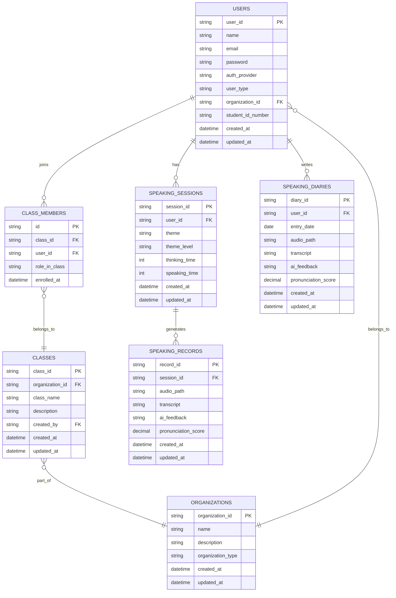

```mermaid
erDiagram
    USERS {
        string user_id PK
        string name
        string email
        string password
        string auth_provider
        string user_type
        string organization_id FK
        string student_id_number
        datetime created_at
        datetime updated_at
    }

    ORGANIZATIONS {
        string organization_id PK
        string name
        string description
        string organization_type
        datetime created_at
        datetime updated_at
    }

    CLASSES {
        string class_id PK
        string organization_id FK
        string class_name
        string description
        string created_by FK
        datetime created_at
        datetime updated_at
    }

    CLASS_MEMBERS {
        string id PK
        string class_id FK
        string user_id FK
        string role_in_class
        datetime enrolled_at
    }

    SPEAKING_SESSIONS {
        string session_id PK
        string user_id FK
        string theme
        string theme_level
        int thinking_time
        int speaking_time
        datetime created_at
        datetime updated_at
    }

    SPEAKING_RECORDS {
        string record_id PK
        string session_id FK
        string audio_path
        string transcript
        string ai_feedback
        decimal pronunciation_score
        datetime created_at
        datetime updated_at
    }

    SPEAKING_DIARIES {
        string diary_id PK
        string user_id FK
        date entry_date
        string audio_path
        string transcript
        string ai_feedback
        decimal pronunciation_score
        datetime created_at
        datetime updated_at
    }

    %% リレーションシップの定義
    USERS          ||--o{ SPEAKING_SESSIONS : has
    SPEAKING_SESSIONS ||--o{ SPEAKING_RECORDS : generates
    USERS          ||--o{ SPEAKING_DIARIES : writes
    USERS          ||--o{ CLASS_MEMBERS : joins
    CLASS_MEMBERS  }o--|| CLASSES : belongs_to
    CLASSES        }o--|| ORGANIZATIONS : part_of
    USERS          }o--|| ORGANIZATIONS : belongs_to
```